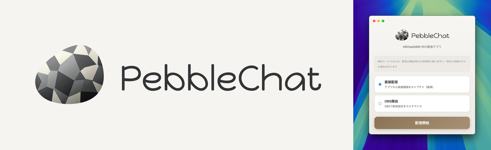

**日本語** | [English](README.en.md) | [한국어](README.ko.md)

# PebbleChat



VRChat / XRift 向けの簡単配信アプリ。ボタンひとつで配信URLを発行、あとは iwaSync や XRift Player に貼るだけ。

## 特徴

- **簡単**: 配信ソースを選んでボタンを押すだけ
- **無料**: 完全無料で配信
- **軽量**: 追加ソフト不要、アプリ1つで完結
- **安全**: 難しいネットワーク設定は不要

## ダウンロード

| OS | ダウンロード |
|----|------------|
| macOS (Apple Silicon) | [PebbleChat-mac-arm64.dmg](https://pub-6e0518c74c774e0f9982db12e9536191.r2.dev/releases/PebbleChat-mac-arm64.dmg) |
| macOS (Intel) | [PebbleChat-mac-x64.dmg](https://pub-6e0518c74c774e0f9982db12e9536191.r2.dev/releases/PebbleChat-mac-x64.dmg) |
| Windows | [PebbleChat-win-x64.exe](https://pub-6e0518c74c774e0f9982db12e9536191.r2.dev/releases/PebbleChat-win-x64.exe) |

### Beta

新機能のテスト版です。安定版より先に最新機能を試せます。

| OS | ダウンロード |
|----|------------|
| macOS (Apple Silicon) | [PebbleChat-mac-arm64-beta.dmg](https://pub-6e0518c74c774e0f9982db12e9536191.r2.dev/releases/beta/PebbleChat-mac-arm64-beta.dmg) |
| macOS (Intel) | [PebbleChat-mac-x64-beta.dmg](https://pub-6e0518c74c774e0f9982db12e9536191.r2.dev/releases/beta/PebbleChat-mac-x64-beta.dmg) |
| Windows | [PebbleChat-win-x64-beta.exe](https://pub-6e0518c74c774e0f9982db12e9536191.r2.dev/releases/beta/PebbleChat-win-x64-beta.exe) |

## 背景

VRChat内でのライブ配信サービス「TopazChat」は、個人運営による持続可能性の問題を抱えています。PebbleChatは、各ユーザーが自分で配信サーバーを立てられるようにすることで、TopazChatへの負荷を分散させることを目指しています。

## ポジショニング

**「TopazChatの代替」ではなく「負荷分散の選択肢」**

- TopazChatは引き続き低遅延が必要なユースケースで活躍
- 遅延が許容できるユースケースは自前配信へ移行
- 全体としてTopazChatへの集中を緩和

## 使い方

```
1. アプリ起動
2. ストリームIDを入力（任意、空欄でランダム生成）
3. 配信モードを選択（直接配信 / OBS経由）
4. 配信ソース選択（画面全体 / 特定ウィンドウ）
5. 「配信開始」ボタンを押す
6. 表示されたURLをiwaSyncに貼る
7. 完了
```

### ストリームID

- **空欄**: ランダムな8文字のIDを自動生成（例: `a1b2c3d4`）
- **カスタム**: 任意のIDを設定可能（英数字とハイフン、3〜20文字）

配信URLは `https://pebble.xrift.net/{streamId}/index.m3u8` の形式になります。

## 技術構成

```
┌─────────────────────────────────────────────────────────┐
│  Electron App (PC)                                      │
├─────────────────────────────────────────────────────────┤
│  desktopCapturer → MediaMTX (H.264エンコード) → RTMP   │
│                              │                          │
│                         React UI                        │
└─────────────────────────────────────────────────────────┘
                              │
                              ▼ RTMP
                    ┌─────────────────────┐
                    │  リレーサーバー       │
                    │  (Oracle Cloud)     │
                    ├─────────────────────┤
                    │  MediaMTX (HLS変換)  │
                    │  Caddy (HTTPプロキシ)│
                    └─────────────────────┘
                              │
                              ▼ HLS
                 iwaSync (VRChat) / XRift Player
```

### 使用技術

| コンポーネント | 技術 | 役割 |
|--------------|------|------|
| フレームワーク | Electron | デスクトップアプリ |
| UI | React + TypeScript | ユーザーインターフェース |
| 画面キャプチャ | Electron desktopCapturer API | 画面/ウィンドウ取得 |
| メディアサーバー | MediaMTX | H.264エンコード / HLS変換 |
| HTTPプロキシ | Caddy | リバースプロキシ |
| インフラ | Oracle Cloud Always Free | リレーサーバー |

## リレーサーバー

| 項目 | 値 |
|-----|---|
| プロバイダ | Oracle Cloud Always Free |
| シェイプ | VM.Standard.E2.1.Micro |
| スペック | 1 OCPU / 1 GB RAM |
| OS | Ubuntu 22.04 Minimal |
| リージョン | Japan East (Tokyo) |
| ドメイン | pebble.xrift.net |
| 月額コスト | **$0**（無料枠） |
| 帯域 | 10TB/月（約22,000視聴時間 @ 480p/1Mbps） |
| トラフィック統計 | [pebble.xrift.net/stats](https://pebble.xrift.net/stats) |

## 配信仕様

| 項目 | 値 |
|-----|---|
| コーデック | H.264 + AAC |
| 解像度 | 480p |
| ビットレート | 1Mbps |
| 遅延 | 約4秒 |
| HLSセグメント | 1秒間隔 |

## 遅延について

| サービス/方式 | 遅延 | 用途適性 |
|-------------|------|---------|
| TopazChat | 約1秒 | DJイベント（MC同期重要） |
| PebbleChat (HLS) | 約4秒 | 作業配信・映像流し・トーク系イベント |

## 開発

### 必要環境

- Node.js 20+
- npm または yarn

### セットアップ

```bash
# 依存関係のインストール
npm install

# 開発モードで起動
npm run dev

# ビルド
npm run build
```

### サーバー管理（Ansible）

```bash
cd ansible

# 接続テスト
ansible -i inventory.yml pebble-relay -m ping

# プレイブック実行
ansible-playbook -i inventory.yml playbook.yml
```

### 配信中ユーザーの確認

デプロイ前に配信中のユーザーがいないことを確認する:

```bash
ssh pebble-relay "ss -tn sport = :1935 | grep -c ESTAB"
```

0 が返れば安全にデプロイ可能。

## 関連リンク

- [XRift](https://xrift.jp) - WebXRベースのメタバース
- [TopazChat](https://booth.pm/ja/items/1752066)
- [MediaMTX](https://github.com/bluenviron/mediamtx)
- [Oracle Cloud Always Free](https://www.oracle.com/cloud/free/)

## ライセンス

MIT

---

**Powered by [XRift](https://xrift.jp)**
