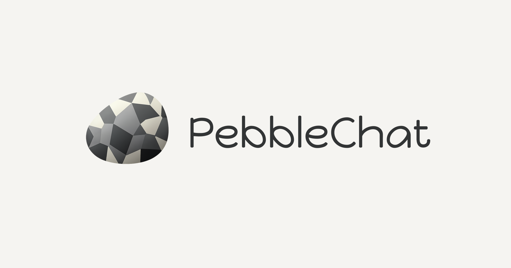

# PebbleChat



VRChat 向けの簡単配信アプリ。OBSもDockerも不要、アプリ一つで配信できます。

## 特徴

- **簡単**: 配信ソースを選んでボタンを押すだけ
- **無料**: 完全無料で配信
- **軽量**: 追加ソフト不要、アプリ1つで完結
- **安全**: 難しいネットワーク設定は不要

## ダウンロード

| OS | ダウンロード |
|----|------------|
| macOS (Apple Silicon) | [PebbleChat-mac-arm64.dmg](https://pub-6e0518c74c774e0f9982db12e9536191.r2.dev/releases/PebbleChat-mac-arm64.dmg) |
| macOS (Intel) | [PebbleChat-mac-x64.dmg](https://pub-6e0518c74c774e0f9982db12e9536191.r2.dev/releases/PebbleChat-mac-x64.dmg) |
| Windows | [PebbleChat-win-x64.exe](https://pub-6e0518c74c774e0f9982db12e9536191.r2.dev/releases/PebbleChat-win-x64.exe) |

## 背景

VRChat内でのライブ配信サービス「TopazChat」は、個人運営による持続可能性の問題を抱えています。PebbleChatは、各ユーザーが自分で配信サーバーを立てられるようにすることで、TopazChatへの負荷を分散させることを目指しています。

## ポジショニング

**「TopazChatの代替」ではなく「負荷分散の選択肢」**

- TopazChatは引き続き低遅延が必要なユースケースで活躍
- 遅延が許容できるユースケースは自前配信へ移行
- 全体としてTopazChatへの集中を緩和

## 使い方

```
1. アプリ起動
2. 配信ソース選択（画面全体 / 特定ウィンドウ）
3. 「配信開始」ボタンを押す
4. 表示されたURLをiwaSyncに貼る
5. 完了
```

## 技術構成

```
┌─────────────────────────────────────────────────────────┐
│  Electron App                                           │
├─────────────────────────────────────────────────────────┤
│  desktopCapturer → MediaMTX (HLS変換) → cloudflared    │
│                              │                          │
│                         React UI                        │
└─────────────────────────────────────────────────────────┘
                              │
                              ▼
                    Cloudflare Quick Tunnels
                              │
                              ▼
                 iwaSync (VRChat) / XRift Player
```

### 使用技術

| コンポーネント | 技術 | 役割 |
|--------------|------|------|
| フレームワーク | Electron | デスクトップアプリ |
| UI | React + TypeScript | ユーザーインターフェース |
| 画面キャプチャ | Electron desktopCapturer API | 画面/ウィンドウ取得 |
| メディアサーバー | MediaMTX | HLS変換 |
| トンネル | cloudflared | 外部公開 |

## 遅延について

| サービス/方式 | 遅延 | 用途適性 |
|-------------|------|---------|
| TopazChat | 約1秒 | DJイベント（MC同期重要） |
| PebbleChat (HLS) | 約4秒 | 作業配信・映像流し・トーク系イベント |

## 開発

### 必要環境

- Node.js 20+
- npm または yarn

### セットアップ

```bash
# 依存関係のインストール
npm install

# 開発モードで起動
npm run dev

# ビルド
npm run build
```

## 関連リンク

- [XRift](https://xrift.jp) - WebXRベースのメタバース
- [TopazChat](https://booth.pm/ja/items/1752066)
- [MediaMTX](https://github.com/bluenviron/mediamtx)
- [Cloudflare Quick Tunnels](https://trycloudflare.com/)

## ライセンス

MIT

---

**Powered by [XRift](https://xrift.jp)**
